# AWS-OpenSearch-ServerLess-Lambda

In This lab we will create a Lambda function that will sends the data to AWS open search server less collection.

## Create a Open Search Server-less collection

Go to AWS Console 


From the left panel, Select "collections".


Click on Create Collection.


Provide a name to Collection and Select "search"


un select the  redundancy check box and select standard create.


Select Network access public. Check both resource type and click next.


Select appropriate data access  permissions.  


Save it as a new policy and click next.


Name the Index as "" demo-index


Review and click Submit.


wait for collection to be created. Do not navigate away  from this page.
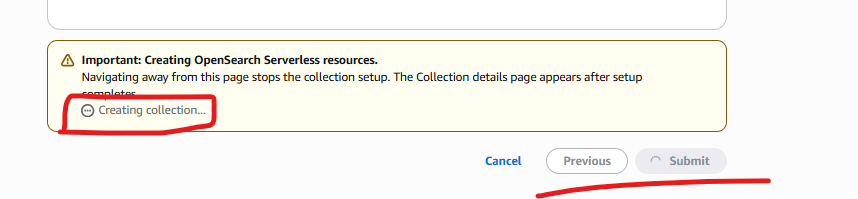

Once your open search collection will be ready screen will look like . Note down the open search endpoint. and dashboard url. we will need this later on.

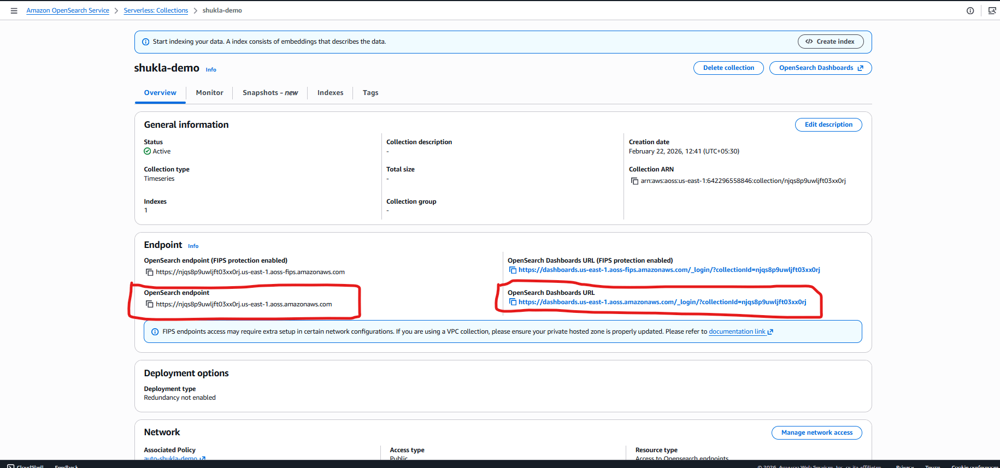

Click on Dashboard Url , and you will see the dashboard.
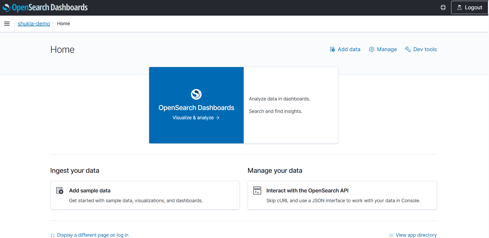

---

### Create Lambda Function that will send Data o this open search

First Create a IAM Role that Lambda will use to connect with AWS opensearch collection.

Create a Policy Name "Shukla-lambda-OSS-access-policy".
```json
{
    "Version": "2012-10-17",
    "Statement": [
        {
            "Sid": "VisualEditor0",
            "Effect": "Allow",
            "Action": "aoss:APIAccessAll",
            "Resource": "*"
        }
    ]
}
```

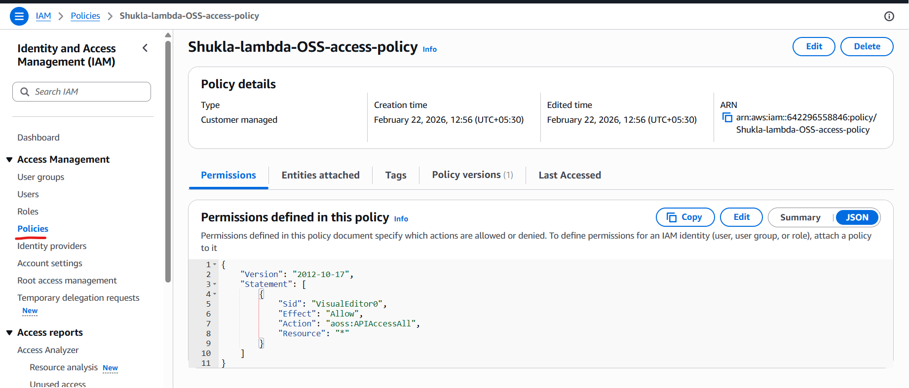

Create a Role for Lambda and assign permission and policy on it.
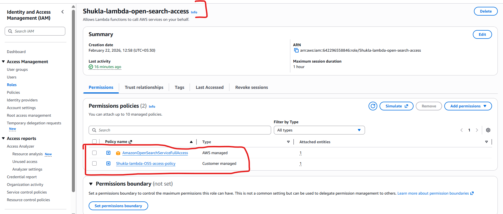

## Lets create a Lambda and Assign the role and permission to it.

Go to AWS console and search form Lambda
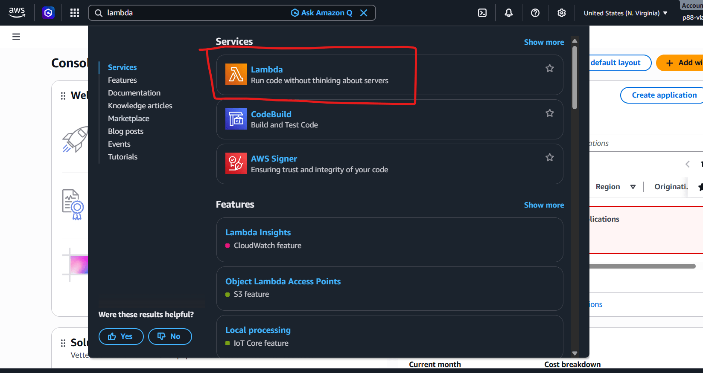
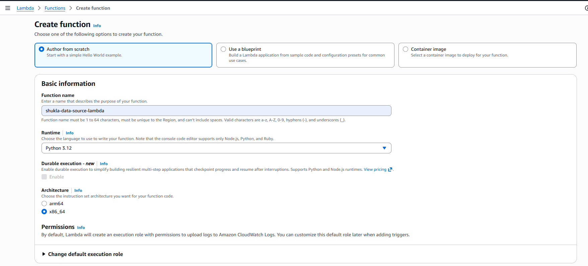
use previously created Role to assign to this lambda. and click createe
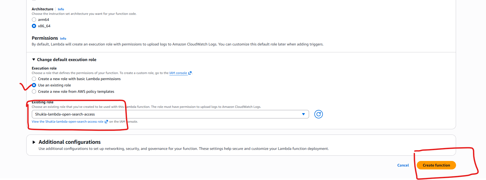
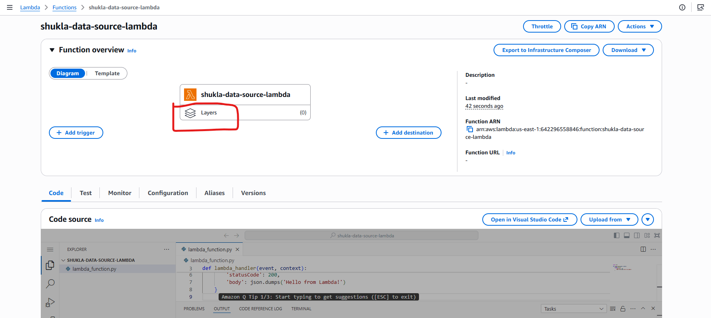

Our lambda function is created in python , this will generate some random data and insert that data in previously created open search collection.

This code has some dependency. these dependencies can not be directly input in the code. AWS lambda use provides a concept of layers to manage it.

### Lets create a layers that can be used in this lambda

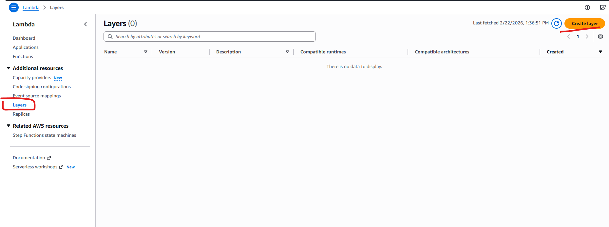
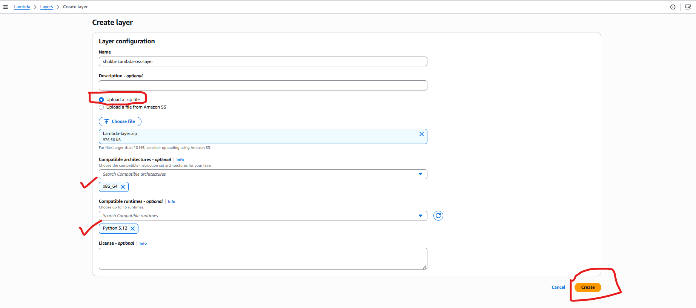
Layer is now ready to reuse.
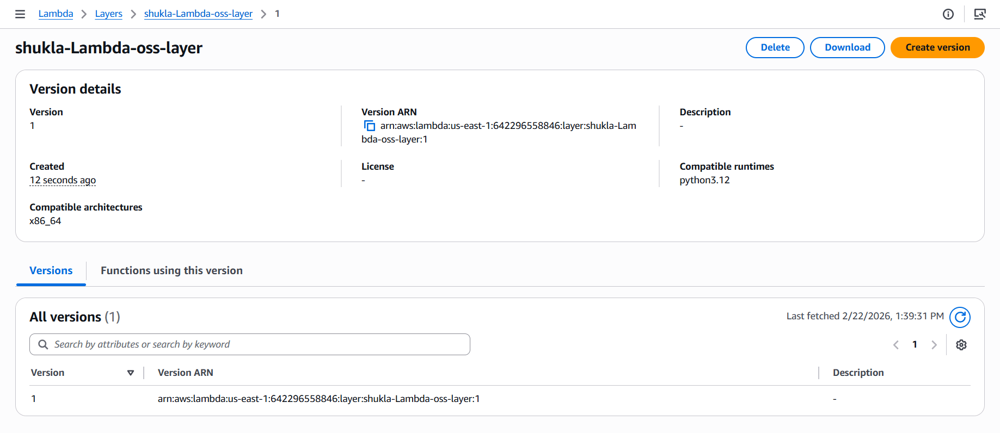

### Lets add this layer in our lambda
Go to the Lambda and click on layers.
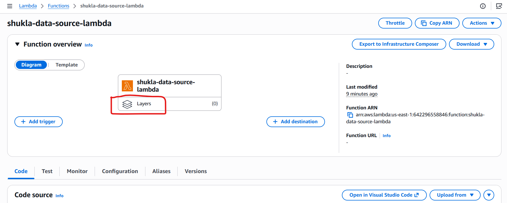

Click on Add a layer.
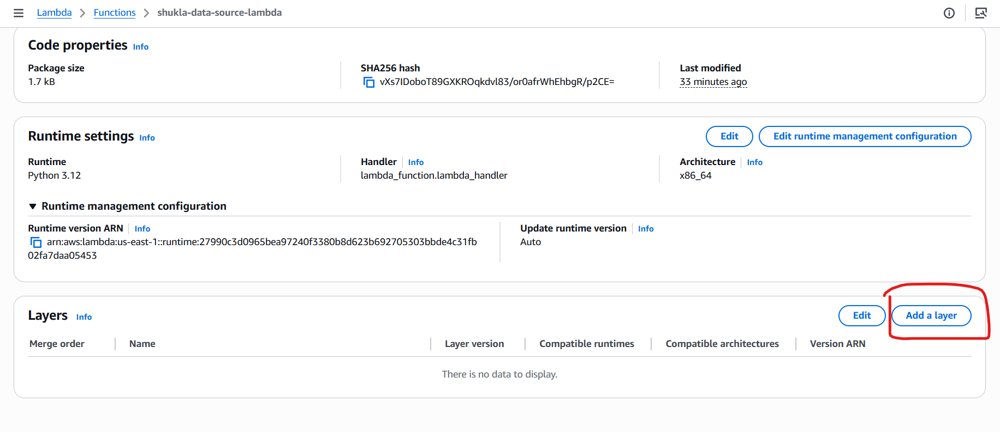
Select the previously added layer from the drop down.  Click Add
  
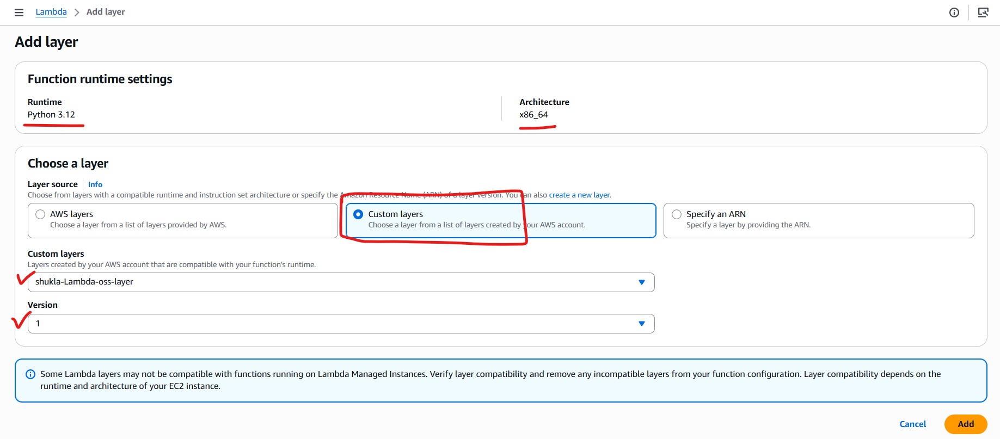

Layer is now successfully Added to the Lambda.
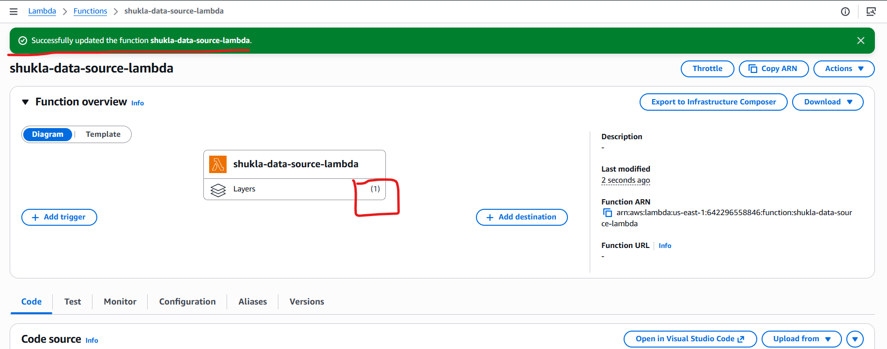


