# AWS-OpenSearch-ServerLess-Lambda

In This lab we will create a Lambda function that will sends the data to AWS open search server less collection.

## Create a Open Search Server-less collection

Go to AWS Console 


From the left panel, Select "collections".


Click on Create Collection.


Provide a name to Collection and Select "search"


un select the  redundancy check box and select standard create.


Select Network access public. Check both resource type and click next.


Select appropriate data access  permissions.  


Save it as a new policy and click next.


Name the Index as "" demo-index


Review and click Submit.


wait for collection to be created. Do not navigate away  from this page.


Once your open search collection will be ready screen will look like . Note down the open search endpoint. and dashboard url. we will need this later on.


Click on Dashboard Url , and you will see the dashboard.


---

### Create Lambda Function that will send Data o this open search

First Create a IAM Role that Lambda will use to connect with AWS opensearch collection.

Create a Policy Name "Shukla-lambda-OSS-access-policy".
```json
{
    "Version": "2012-10-17",
    "Statement": [
        {
            "Sid": "VisualEditor0",
            "Effect": "Allow",
            "Action": "aoss:APIAccessAll",
            "Resource": "*"
        }
    ]
}
```


Create a Role for Lambda and assign permission and policy on it.


## Lets create a Lambda and Assign the role and permission to it.

Go to AWS console and search form Lambda


use previously created Role to assign to this lambda. and click createe


Our lambda function is created in python , this will generate some random data and insert that data in previously created open search collection.

This code has some dependency. these dependencies can not be directly input in the code. AWS lambda use provides a concept of layers to manage it.

### Lets create a layers that can be used in this lambda


Layer is now ready to reuse.


### Lets add this layer in our lambda
Go to the Lambda and click on layers.


Click on Add a layer.

Select the previously added layer from the drop down.  Click Add
  


Layer is now successfully Added to the Lambda.


### Lets deploy code to this lambda.

Here is the lambda code. make sure you change the Open search endpoint with your.

```plaintext
import json
import boto3
import requests
import uuid
import random
from datetime import datetime, timedelta
from requests_aws4auth import AWS4Auth
from botocore.exceptions import BotoCoreError, NoCredentialsError
from requests.exceptions import RequestException, Timeout, ConnectionError

# ---------- CONFIG ----------
region = "us-east-1"
service = "aoss"
host = "Open Search Host url here"
index_name = "demo-index"

headers = {"Content-Type": "application/json"}

# ---------- MESSAGE GENERATOR ----------
def generate_message(service):
    messages = {
        "PaymentService": [
            "Payment processed successfully",
            "Card authorization failed",
            "Refund initiated"
        ],
        "OrderService": [
            "Order created",
            "Order validation failed",
            "Inventory reserved"
        ],
        "AuthService": [
            "User login success",
            "Invalid token detected",
            "Session expired"
        ]
    }
    return random.choice(messages.get(service, ["Unknown event"]))

# ---------- DATA GENERATION ----------
def generate_records(count=500):

    services = ["PaymentService", "OrderService", "AuthService"]
    logs = []

    for i in range(count):

        service_name = random.choice(services)

        log = {
            "ServiceName": service_name,
            "Level": "ERROR" if random.randint(0,10) > 7 else "INFO",
            "Message": generate_message(service_name),
            "TraceId": str(uuid.uuid4()),
            "UserId": f"user-{random.randint(1,10)}",
            "Timestamp": (datetime.utcnow() - timedelta(seconds=random.randint(0,600))).isoformat(),
            "ResponseTimeMs": random.randint(50,800),
            "source": "aws-lambda",
            "env": "demo"
        }

        logs.append(log)

    return logs

# ---------- BULK PAYLOAD BUILDER ----------
def build_bulk_payload(docs):
    try:
        bulk_data = ""
        for doc in docs:

            # Using TraceId as unique document id (log-style ingestion)
            action = {"index": {"_index": index_name}}

            bulk_data += json.dumps(action) + "\n"
            bulk_data += json.dumps(doc) + "\n"

        return bulk_data

    except Exception as e:
        raise Exception(f"Bulk payload creation failed: {str(e)}")

# ---------- MAIN HANDLER ----------
def lambda_handler(event, context):

    try:
        # ---------- AUTH CREATION ----------
        try:
            session = boto3.Session()
            creds = session.get_credentials().get_frozen_credentials()

            awsauth = AWS4Auth(
                creds.access_key,
                creds.secret_key,
                region,
                service,
                session_token=creds.token
            )

        except (BotoCoreError, NoCredentialsError) as auth_error:
            return {
                "statusCode": 500,
                "body": json.dumps({
                    "error": "AWS authentication failed",
                    "details": str(auth_error)
                })
            }

        # ---------- DATA GENERATION ----------
        try:
            documents = generate_records(500)
            payload = build_bulk_payload(documents)

        except Exception as data_error:
            return {
                "statusCode": 500,
                "body": json.dumps({
                    "error": "Data generation failed",
                    "details": str(data_error)
                })
            }

        bulk_url = f"{host}/{index_name}/_bulk"

        # ---------- REQUEST EXECUTION ----------
        try:
            response = requests.post(
                bulk_url,
                auth=awsauth,
                headers=headers,
                data=payload,
                timeout=30
            )

        except Timeout:
            return {
                "statusCode": 504,
                "body": json.dumps({"error": "Request timeout to OpenSearch"})
            }

        except ConnectionError:
            return {
                "statusCode": 503,
                "body": json.dumps({"error": "Connection error to OpenSearch"})
            }

        except RequestException as req_error:
            return {
                "statusCode": 500,
                "body": json.dumps({
                    "error": "Request execution failed",
                    "details": str(req_error)
                })
            }

        # ---------- RESPONSE VALIDATION ----------
        try:
            response_json = response.json()
        except Exception:
            response_json = {"raw_response": response.text}

        bulk_errors = response_json.get("errors", False)

        return {
            "statusCode": response.status_code,
            "body": json.dumps({
                "bulkErrors": bulk_errors,
                "response": response_json
            })
        }

    # ---------- GLOBAL FALLBACK ----------
    except Exception as unexpected_error:
        return {
            "statusCode": 500,
            "body": json.dumps({
                "error": "Unexpected lambda failure",
                "details": str(unexpected_error)
            })
        }
```

Lets deploy the lambda.

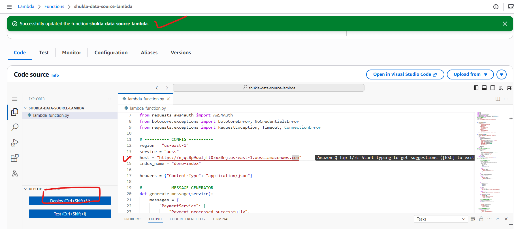

Lets create a test event .
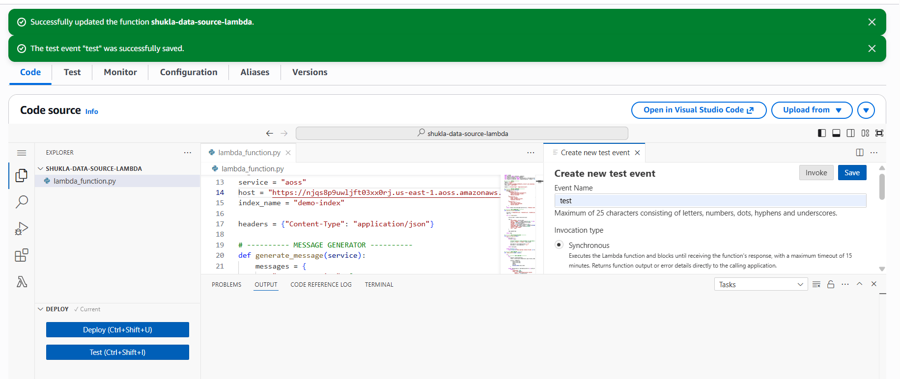

Run the test and you will see that it showing autorization failure.
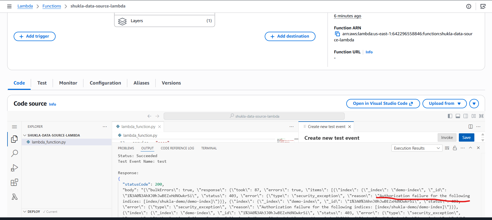

Reason for this failure it. that lambda is not able to connect with AWS open search console.

Lets change the data access policy of AWS open search console and add the "ARN of the role created earlier"

Go to the open search console and access the data access policy.
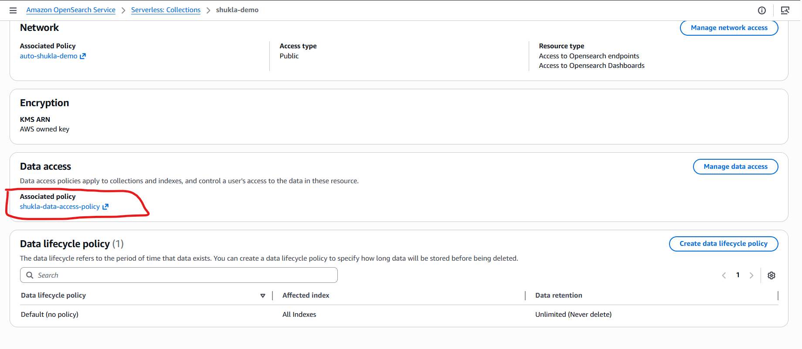
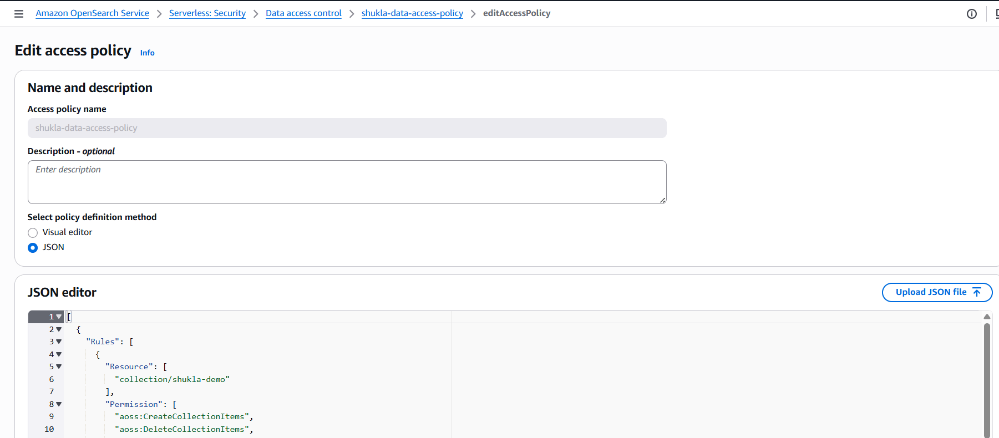

Add the Role arn and click save.
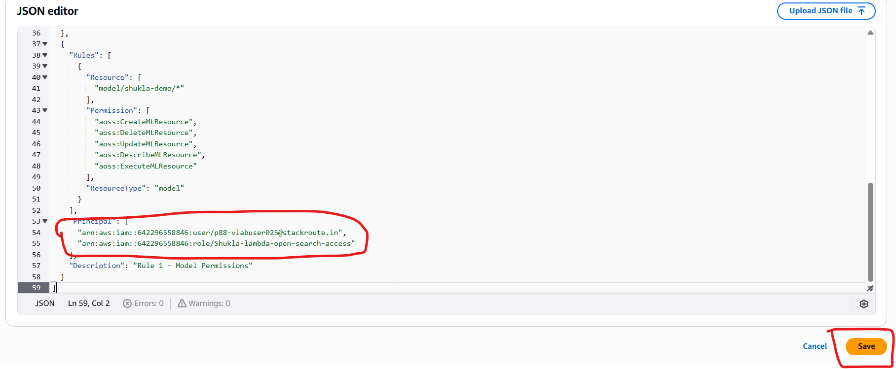

Wait for 1-2 minute to policy get in effect.

Lets execute the Lambda function again. we can see the success.

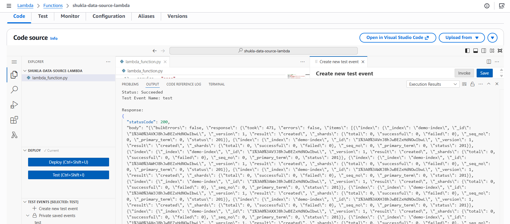

---
## Lets create a dashboard of the inserted data for visualization.

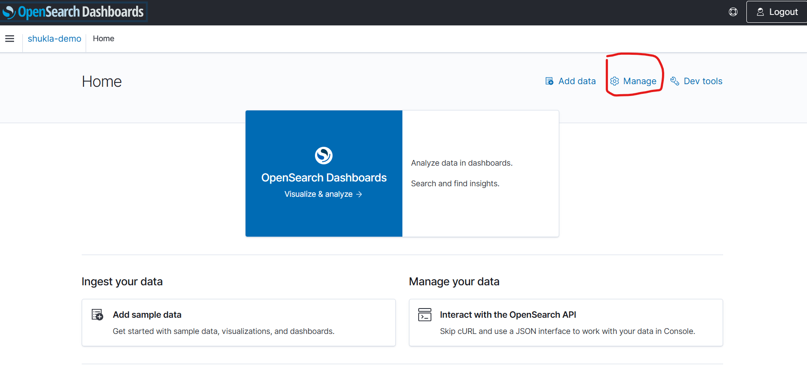
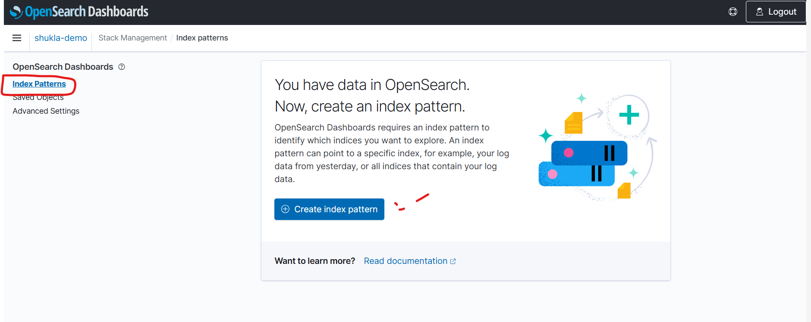
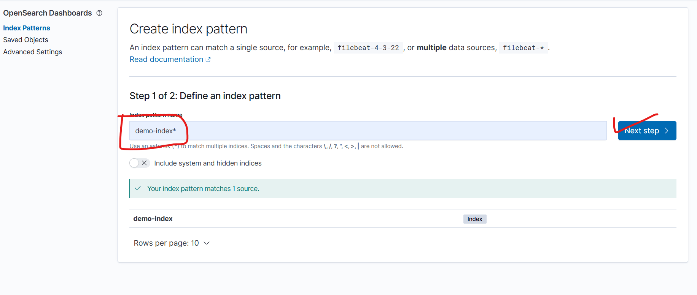
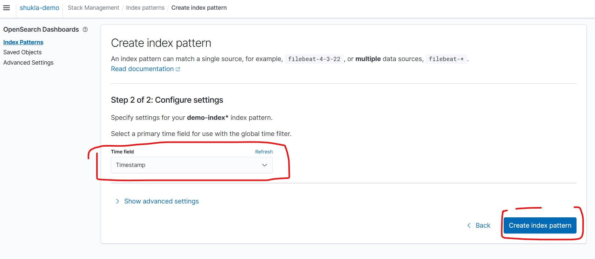
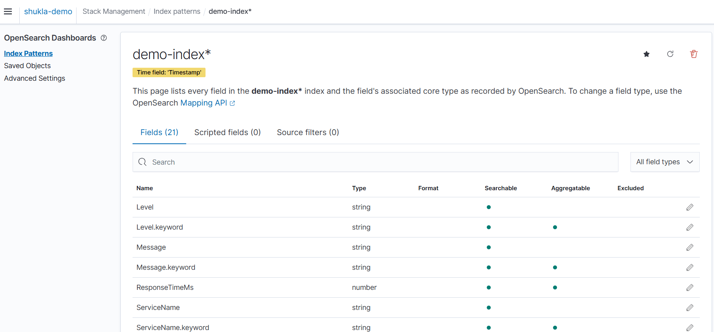
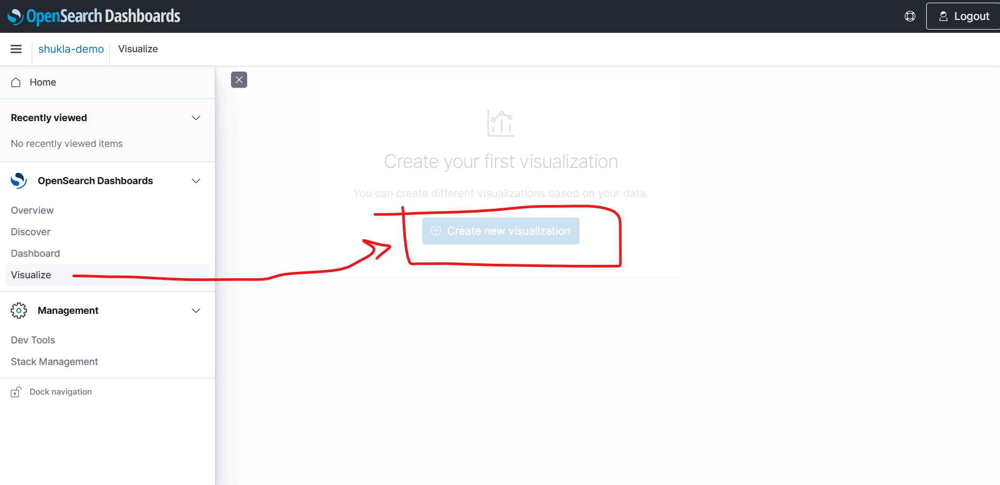
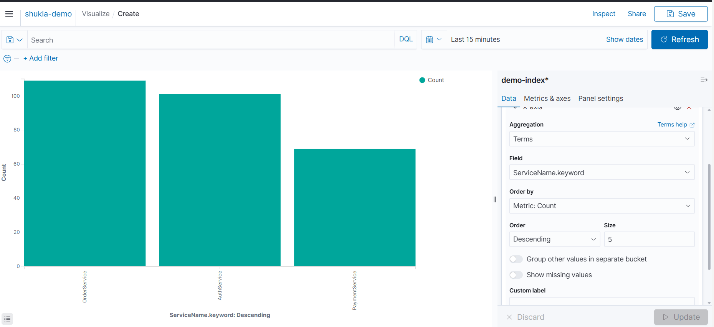


