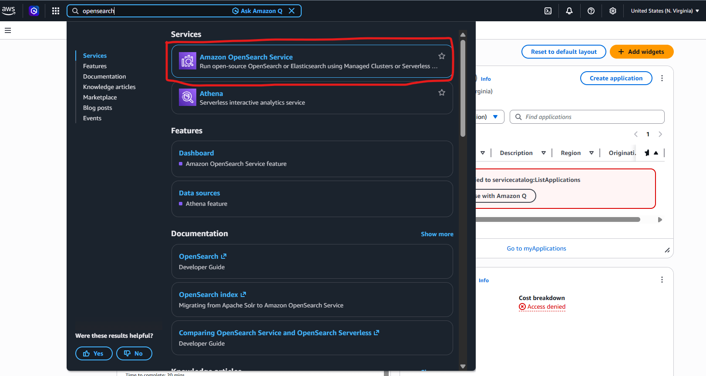
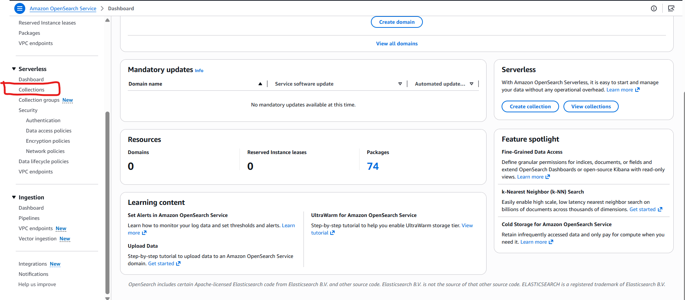
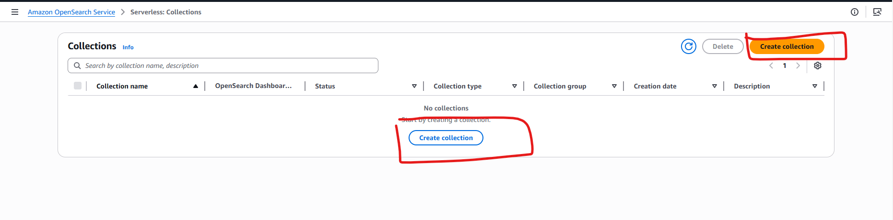
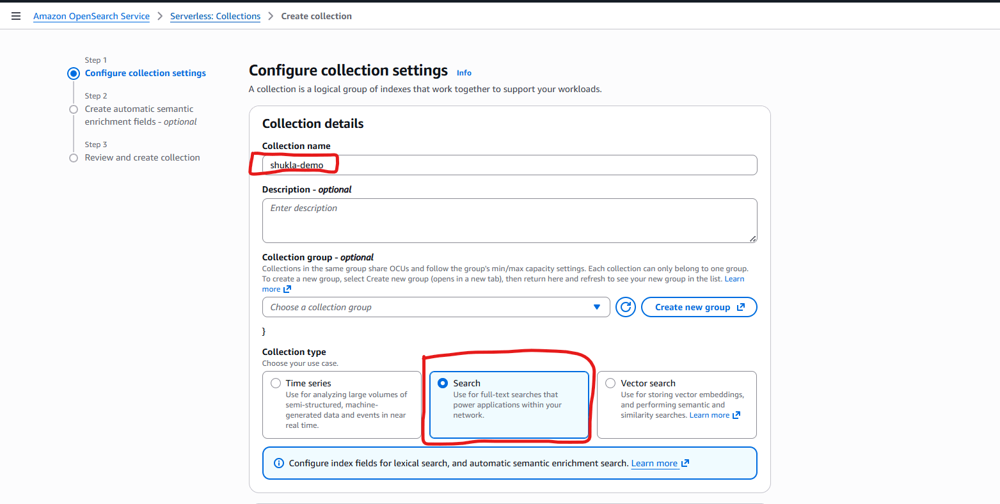
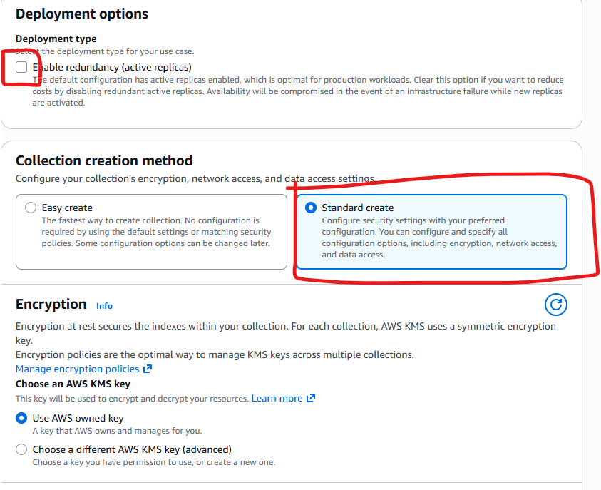
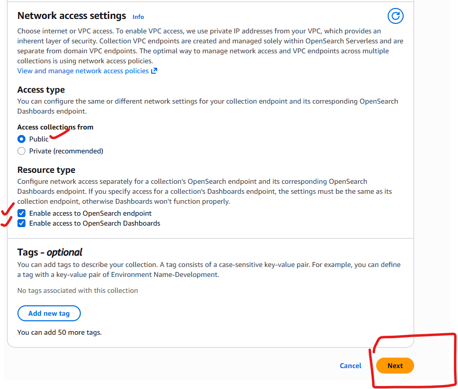
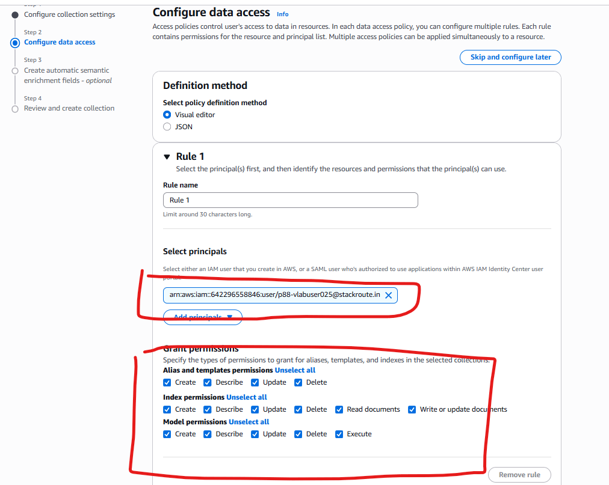
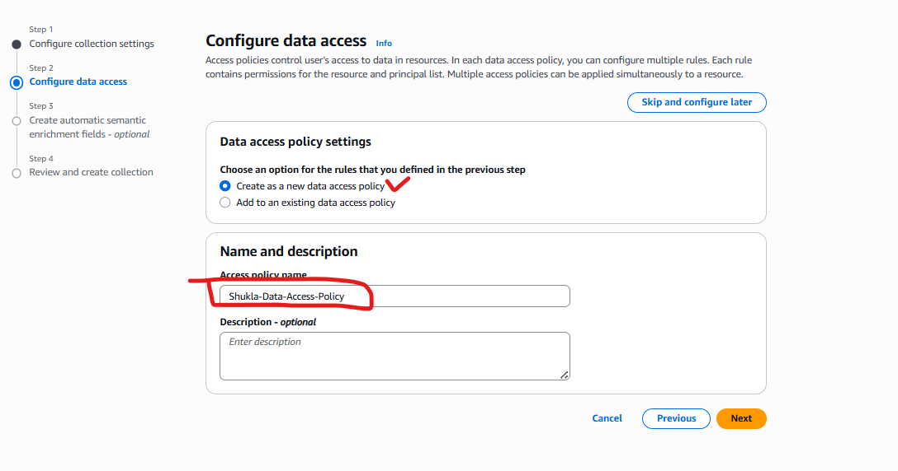
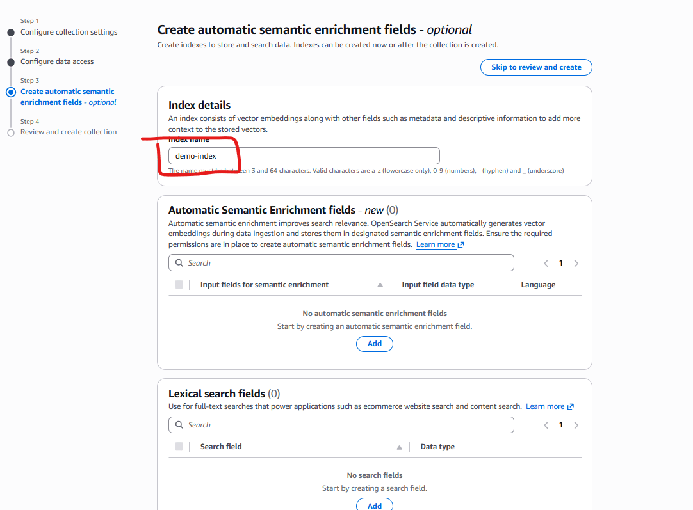
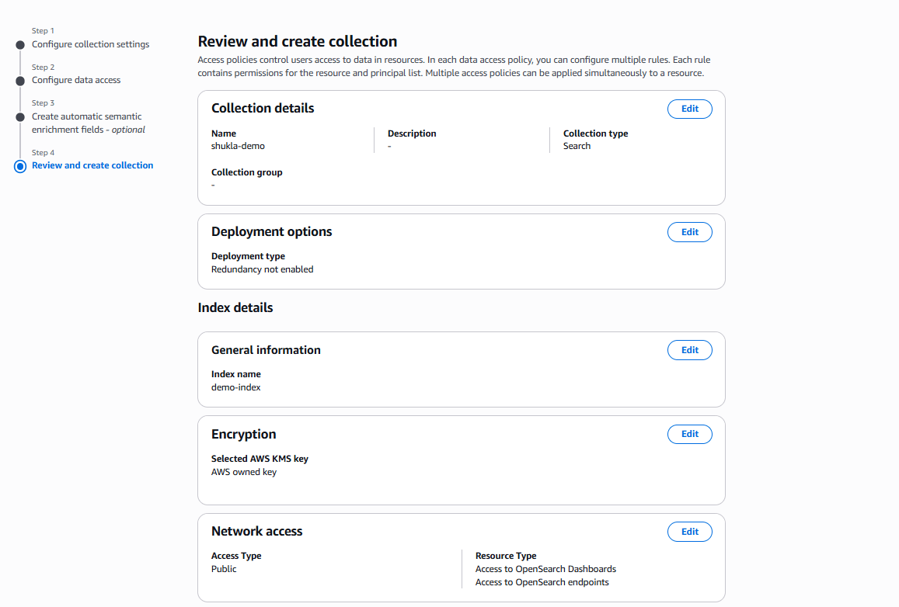

# AWS-OpenSearch-ServerLess-Lambda

In This lab we will create a Lambda function that will sends the data to AWS open search server less collection.

## Create a Open Search Server less collection

Go to AWS Console 

From the left panel, Select "collections".

Click on Create Collection.

Provide a name to Collection and Select "search"

un select the  redundency check box and select standard create.

Select Network access public. Check both resource type and click next.

Select appropriate data access  permissions.  

Save it as a new policy and click next.

Name the Index as "" demo-index

Review and click Submit.

